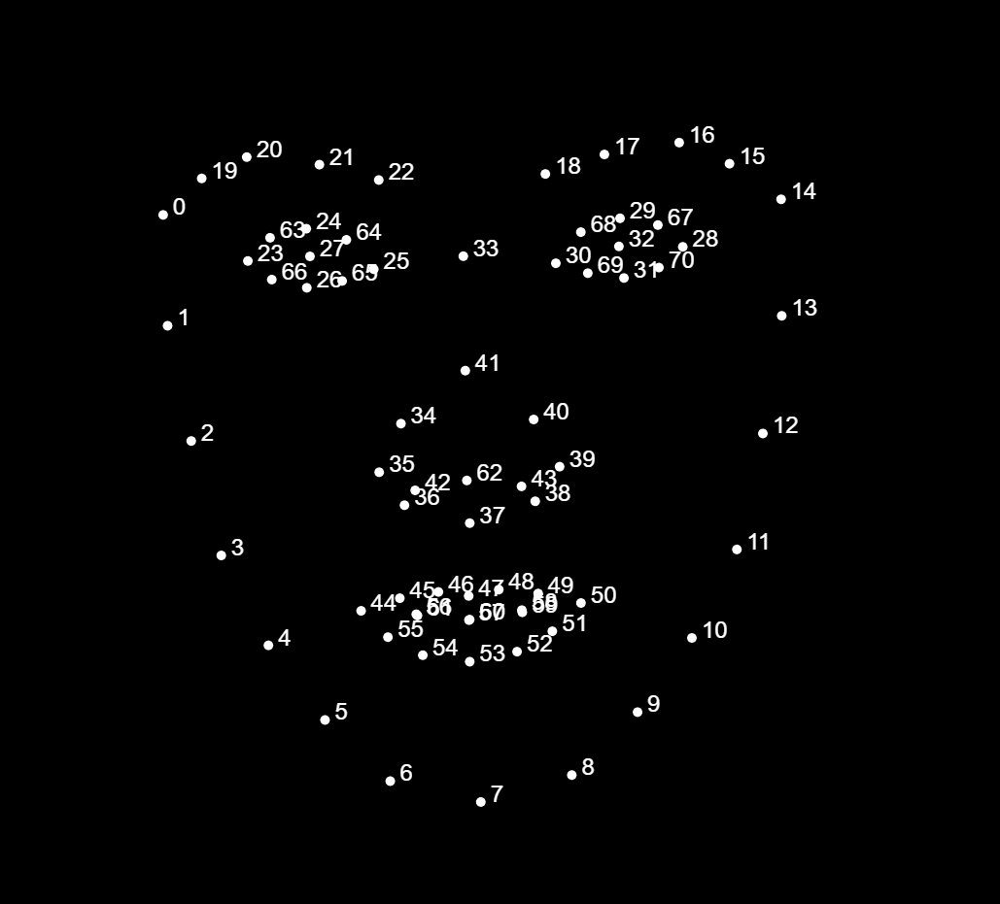
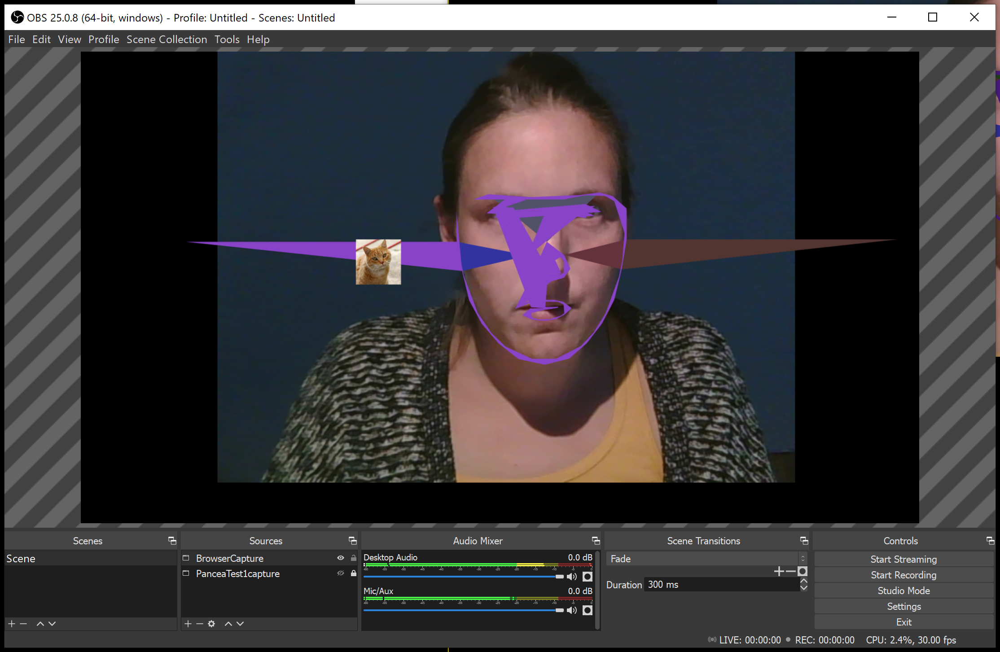
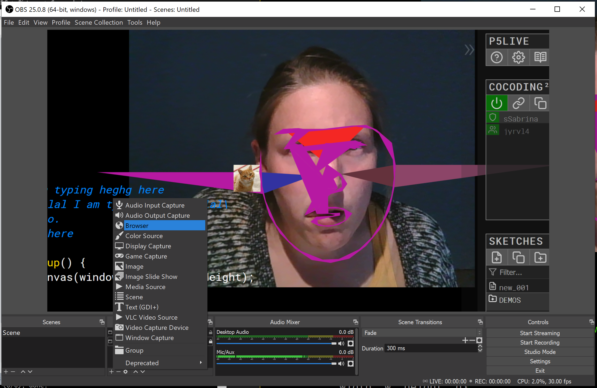
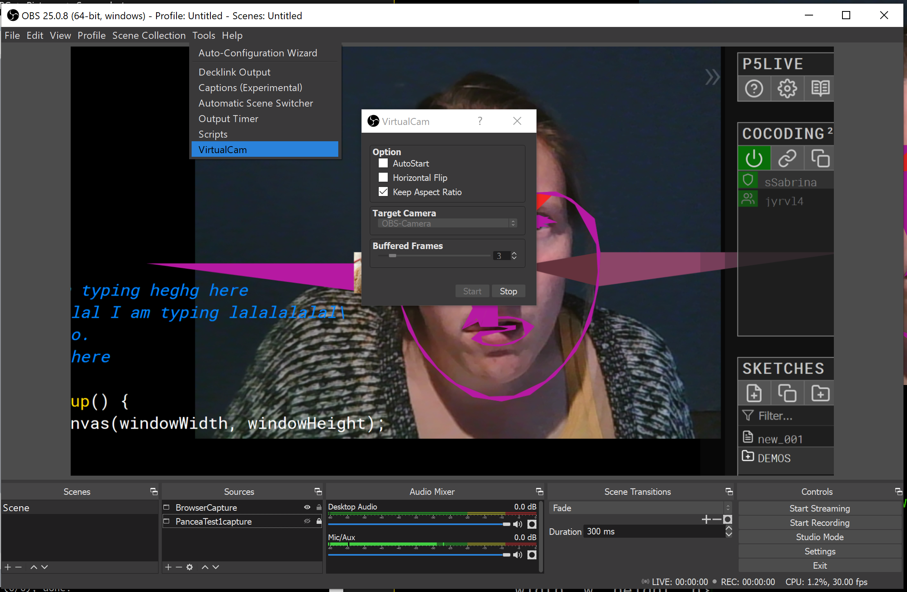
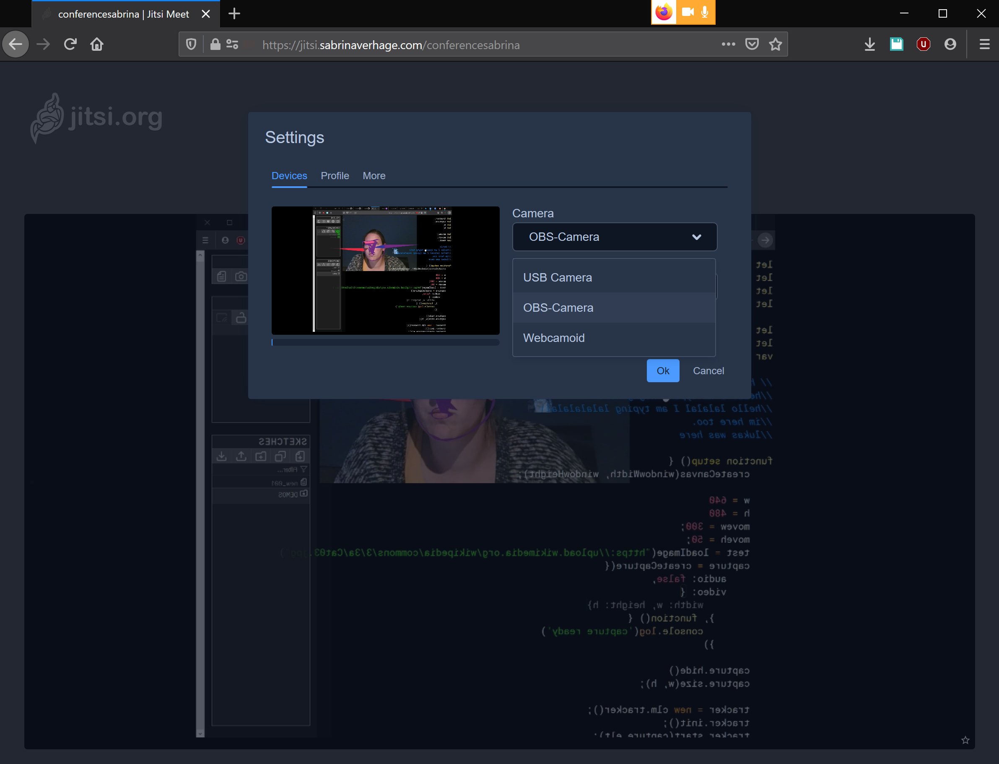
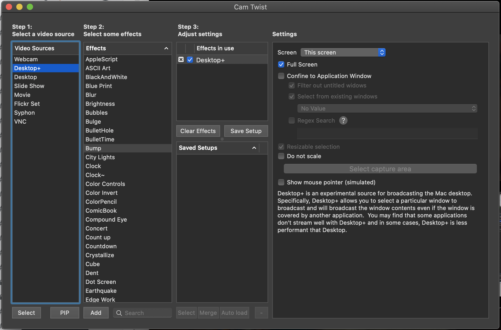
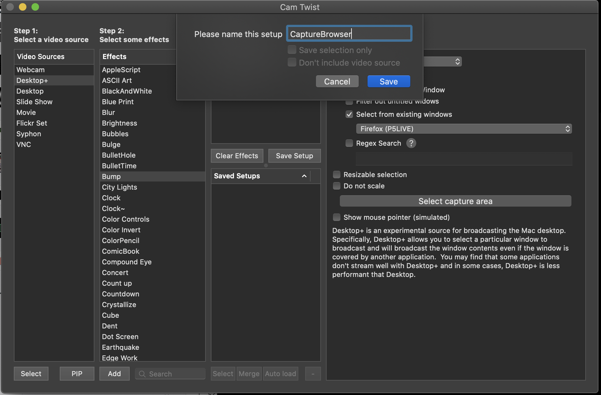
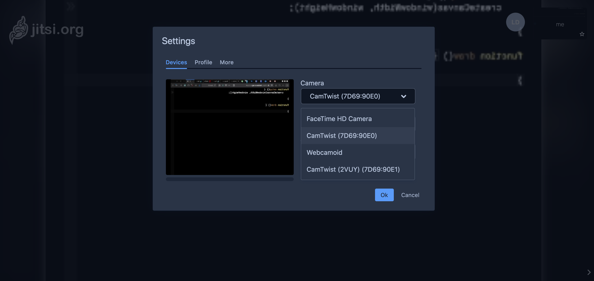

# Panacea Live Coding Filter Workshop

We will run a live creative coding workshop over video call in which we will live code our face filters 

## How To Get Started

First you will need to download the required software to setup a virtual camera. 
We will use the virtual camera to stream your screen to the video call so that we can all see each other's creations. 

Scroll down to "Setting up a virtual camera" below.


## p5.js editor

We will use the p5.js online editor: https://editor.p5js.org/. Please create an account for your convenience; with an account you can save your sketches for later. 

Here's the example sketch to get you started https://editor.p5js.org/SabrinaVerhage/sketches/qUdZEgRdS. 

You can also find this example code in the 'startscript' folder.

#### Using the clmtrackr face tracking library 

This is how to use the clmtrackr library in p5.js.

1. Make sure to import the library in the index.html

```html
<script src="https://www.auduno.com/clmtrackr/build/clmtrackr.min.js"></script>
```

2. Set the variables needed for tracking

```javascript
let capture
let tracker
var w = 640
var h = 480
```

3. Initiate the webcam capture object and the tracker object in the setup() function

```javascript
function setup() {
  createCanvas(w, h)
  
  // setup the webcam capture
  capture = createCapture(VIDEO)
  capture.hide()
  capture.size(w,h)
  
  // setup the face tracker
  tracker = new clm.tracker()
  tracker.init()
  tracker.start(capture.elt)
}
```

4. When the face is tracked we can identify 70 unique points. For each point we will be able to get the x and the y position. The code below will draw all the available points and their numbers using a for loop.

<p align="center" >
  
</p>


```javascript
function draw() {
  // not receive the positions from the face tracker
  let positions = tracker.getCurrentPosition()

  if(positions.length>0) {
  	for(var i = 0; i < positions.length; i++) {
      ellipse(positions[i][0], positions[i][1], 5, 5)
      text(i, positions[i][0], positions[i][1])
    }
  }
}
```

5. Now you can create anything you like using these points. For instance if you want to draw a circle of 20px by 20px on point number 1; you can access the x and y position of point number 1 with 'positions[1][0]' and 'positions[1][1]'. The first number referring to the point number (in this case 1) and the second number rereferring to it's x (0) or y (1) position. 

```javascript
ellipse(positions[1][0], positions[1][1], 20, 20);
```

### Drawing examples

In the folder 'examplefunction' you can find some example code for how to draw the nose, eye or mouth outlines. 

## Setting up a virtual camera

This is a step-by-step of how to install the required sofware to share your screen or a specific window as a virtual camera. Depending our your operating system follow the instructions below.  

### Windows: OBS Studio
Download and install [OBS Studio](https://obsproject.com/download)

This is what OBS Studio looks like


Download and install the [OBS VirtualCam plugin](https://github.com/CatxFish/obs-virtual-cam/releases)

Select the source for OBS to capture from. Go to Sources at the bottom of the window and press the '+' button to add a new source. If you want to share your browser window; select Browser. 



Once yo have the VirtualCam plugin installed you can go to Tools > VirtualCam to start streaming your source to a virtual camera. 



Now when you're going into a hangouts/jitsi go the settings and select the OBS-Camera.



And you're done!


### Mac: CamTwist
Download and install [CamTwist](http://camtwiststudio.com/).

! restart your computer !

Now open CamTwist.
The interface is not very intuitive so let's go through this together:

1. Select a video source underneath 'Step 1'
Desktop+ let's you share your screen/window from your desktop. 
Click on Desktop+ and hit 'Select' (below).

Desktop+ appears in the 'Effects in use' window. 

In the Settings window to the right you can set which window you would like to record

- Fullscreen 
- Confine to Application Window e.g. select from existing windows 
- Resizable selection (and then 'Select capture area')



2. Now we have to 'Save Setup'; pick any name you like. It should apear in the Saved Setups window. 



3. Now select your saved setup by highligthing it and hitting the button 'Select' underneath. 

4. Now when you're going into a hangouts/jitsi go the settings and select CamTwist.



And you're done!
